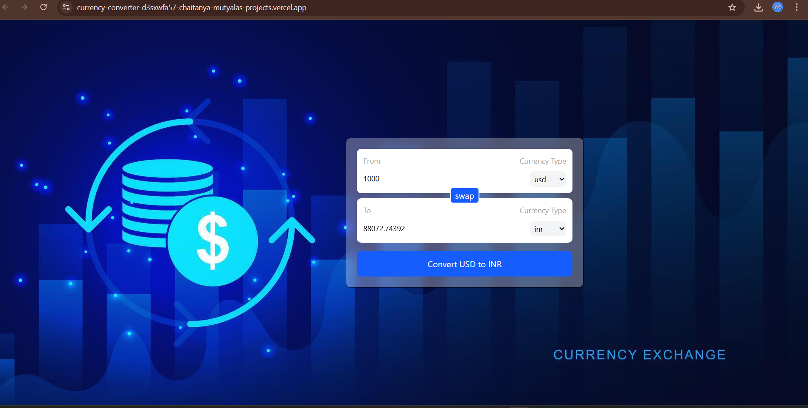

# 💱 Currency Converter

A simple and interactive currency converter built with **React (Vite)**, **TailwindCSS**, and a free currency API.  
It allows users to convert between multiple world currencies in real time.

🔗 **Live Demo:** [Currency Converter](https://currency-converter-d3sxwfa57-chaitanya-mutyalas-projects.vercel.app/)

---

## 🚀 Features
- Convert between multiple currencies instantly  
- Real-time exchange rates (via [@fawazahmed0/currency-api](https://github.com/fawazahmed0/currency-api))  
- Swap currencies with one click  
- Clean, responsive UI with TailwindCSS  
- Accessible inputs with proper labels (using React `useId`)  

---

## 🛠️ Tech Stack
- **React (Vite)** – frontend framework  
- **TailwindCSS** – styling  
- **Custom React Hook** – for fetching exchange rates  
- **Vercel** – deployment  

---

## 📂 Project Structure
```
src/
 ├── App.jsx              # Main component
 ├── main.jsx             # Entry point
 ├── hooks/
 │    └── useCurrencyInfo.js   # Custom hook for fetching rates
 ├── components/
 │    └── InputBox.jsx    # Reusable input + dropdown component
 ├── index.css            # Tailwind styles
 └── index.html           # Root HTML
```

---

## ⚡ Getting Started (Local Setup)

1. **Clone this repo**
   ```bash
   git clone https://github.com/chaitanya-mutyala/currency-converter.git
   cd currency-converter
   ```

2. **Install dependencies**
   ```bash
   npm install
   ```

3. **Run development server**
   ```bash
   npm run dev
   ```

   Open [http://localhost:5173](http://localhost:5173) in your browser.

4. **Build for production**
   ```bash
   npm run build
   npm run preview
   ```

---

## 📸 Screenshot


---

## 🔮 Future Improvements
- Add support for historical exchange rates  
- Show currency symbols/flags for better UX  
- Offline caching of latest rates  
- Dark mode UI  

---

## 👨‍💻 Author
Built with ❤️ by **Chaitanya Mutyala**  
🔗 [Live App](https://currency-converter-d3sxwfa57-chaitanya-mutyalas-projects.vercel.app/)
